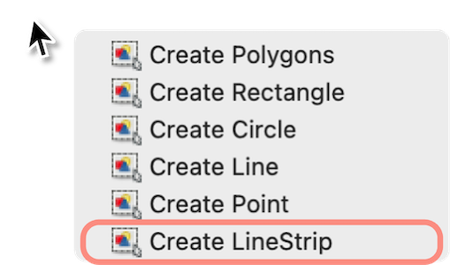

# CULane
- [CULane](#culane)
  - [车道线定义](#车道线定义)
  - [数据集介绍](#数据集介绍)
    - [数据集下载](#数据集下载)
    - [数据集结构](#数据集结构)
    - [训练文件](#训练文件)
    - [标注格式](#标注格式)
  - [自制数据集](#自制数据集)
    - [数据集目录结构](#数据集目录结构)
    - [采集数据集](#采集数据集)
    - [标注流程及规范](#标注流程及规范)
    - [标注完成后数据处理](#标注完成后数据处理)
    - [数据集转换](#数据集转换)
    - [数据集检查](#数据集检查)


## 车道线定义


如上图所示,CULane 数据集中定义了 4 条车道线，分别为 `1`(左左)、`2`(左)、`3`(右)、`4`(右右)；此外还有另一种表述方式，`1`(左)、`2`/`3`(自车道线)、`4`(右)


## 数据集介绍

### 数据集下载

从 [CULane](https://xingangpan.github.io/projects/CULane.html) 下载数据集，如果不使用该数据集，而是自制数据集则跳过该部分，从 [数据集结构](#数据集结构) 继续。

下载完成后，设置环境变量 `CULANEROOT` 为数据集路径，可以写入 `~/.bashrc` 中，或者在每次使用时设置。设置完成后，下面的描述中将使用 `$CULANEROOT` 表示数据集路径。
```shhell
# ~/.bashrc
export CULANEROOT=/path/to/CULane
```
运行如下命令，解压数据集
```sh
bash datasets/unpack-CULane.sh
```

### 数据集结构
得到目录结构如下：
```sh
$CULANEROOT
|──driver_xx            # 按视频文件划分的原始图像和点标注
|──...                  # 多个
|──laneseg_label_w16    # 分割标注
└──list                 # 训练文件列表
```
- `driver_xx` : 按视频文件划分的原始图像和点标注
- `laneseg_label_w16` : 分割标注
- `list` : 训练文件列表，包括训练集 `train_gt.txt` 和验证集 `val_gt.txt`

### 训练文件
`list` 中 `train_gt.txt` 文件记录了训练的文件径和车道线位置
```txt
/dir1/00000.jpg /dir2/00000.png 1 1 1 1
/dir1/00030.jpg /dir2/00030.png 0 1 1 1
...
```
- `dir1`内的文件表示车道线点的图像和标注，`dir2`内的文件表示车道线分割图像，这两种目录对应两种不同车道线检测的路线，前者对应点检测的方法，后者对应分割算法，UFLD算法是点检测算法，所以通常只需要使用到`dir1`内文件。
- 最后的4个数字分别表示 `1`/`2`/`3`/`4` 的车道线是否存在

### 标注格式
在`dir1`中每张图像都有其对应的标注文件，文件后缀为 `.lines.txt`，标注文件大致结构如下
```txt
-16.9803 490 21.2945 480 ...
267.511 590 284.513 580 ...
1197.91 590 1185.25 580 ...
1649.3 450 1598.81 440 ...
```
- 每一行表示一条车道线，每一行分别为标注的点的坐标，例如 `-16.9803 490 21.2945 480 ...` 表示该车道线上标注的点的坐标为 `(-16.9803, 490), (21.2945, 480), ...`
- 每条车道线最长大约32个点，但是应该不少于10个点
- 不存在车道线的情况不标准

这里提供一个脚本查看对应图像的标注情况，`<label_dir>`是图片和标注的目录，需要自行修改，输出结果保存在 `<label_dir>-check` 目录下
```shell
python3 datasets/check-culane.py --label_dir <label_dir>
# 例如 
python3 datasets/check-culane.py --label_dir <path-to-CULane>/driver_100_30frame/05260019_0572.MP4`
```

## 自制数据集

### 数据集目录结构
为了和 CULane 数据集结构保持一致，我们将自制数据集的目录结构规定如下
```shell
$CULANEROOT # 环境变量中设置的数据集路径
|──videos   # 原始视频文件
|   |──video1.mp4   # 视频1
|   |──video2.mp4   # 视频2
|   └──...
|──raw_images   # 原始采集的图像
|   |──video1     # 视频1的图像
|   |  |──video1-0.jpg  # 第0帧图像
|   |  |──video1-0.json # 第0帧图像的 labelme 标注
|   |  └──...
|   |──video2
|   └──...
|──images   # 标注完成后端数据
|   |──video1-0.jpg
|   |──video1-0.lines.txt
|   └──...
|──labels   # 标签文件
|   |──video1-0.png
|   └──...
└──list     # 训练文件列表
```

> 自制数据集可以自定义名称，但是需要设置环境变量 `CULANEROOT` 为数据集路径，并写入环境变量 `~/.bashrc` 中。因为在数据集相关的处理的脚本中会直接读取环境变量 `CULANEROOT` 

### 采集数据集

数据集的采集需要拍摄视频，要求：
- 拍摄要求稳定，尽量避免抖动
- 运动过程中开始拍摄，在停止运动前结束拍摄，这是为了避免视频中存在静止不动的片段

拍摄完成视频后，需要修改视频名称，修改为拍摄时间，例如 `20210801_101234.mp4`，并将视频放入 `$CULANEROOT/videos` 目录下。整理完视频后，运行如下命令，将视频切分为图像，并在图像文件旁生成对应的预标注文件，预标注文件是 labelme 格式，采样传统视觉的算法进行预先标注，如果效果不好，可以将预标注文件删除，重新标注。标注完成后。
```shell
python3 datasets/split-video.py
# datasets/split-video-using-onnx.py # 使用 onnx 进行预标注
```


### 标注流程及规范

自制数据集需要安装 [labelme](https://github.com/wkentaro/labelme)
```shell
pip3 install labelme
```
```shell
# only for Apple Silicon
brew install pyqt  # maybe pyqt5
pip install labelme

# or
brew install wkentaro/labelme/labelme  # command line interface
# brew install --cask wkentaro/labelme/labelme  # app
# or install standalone executable/app from:
# https://github.com/wkentaro/labelme/releases 
```

在终端运行如下命令启动 labelme 后界面如下
```shell
labelme
```


标注数据集请按照如下步骤进行
1. 选择 `Open Dir` 打开数据集所在的目录，也就是 `$CULANEROOT/images` 

2. 点击 `Create Polygons` 创建标注，右键选择 `Create LineStrip` 线段标记模式



1. 在图像上「从左到右」的顺序依次标注各个车道线，按照「**从下到上**」沿着车道线标注(10~20个点即可)，完成单个车道线标注后`Enter` ，此时弹窗需要设置类别并给出标注的类别，如下


1. 点击 `Next Image`/`Prev Image` 依次完成全部图像的标注

> labelme 的使用方法、快捷键可以参考[官方文档](https://github.com/wkentaro/labelme)
### 标注完成后数据处理
### 数据集转换

labelme 标注的文件是 json 文件，需要检查并转换为 CULane 中使用的 txt 文件，这里给出转换的脚本
```shell
python3 datasets/labelme2culane.py
```
运行后，会生成 `imgtxt` 目录(目录结构参考[数据集目录结构](#数据集目录结构))，其中包含了全部视频文件的转换后合并的数据及标签文件；生成一个 `images_visual` 目录，包含标注时候的可视化结果，用于检查标注是否正确
```shell
$CULANEROOT   # 环境变量中设置的数据集路径
|──...
|──images_visual  # 标注结果检测
|──imgtxt         # CULane 格式数据集
|   |──video1-0.jpg       # 图像
|   |──video1-0.lines.txt # 车道线标注
|   └──...
└──...
```
至此，完成了数据集的制作

### 数据集检查
可以使用 `datasets/check-culane.py` 检查转换结果是否正确
```shell
python3 datasets/check-culane.py
```
运行后生成一个`imgtxt-check` 目录，其中包含了检查结果，如下
```shell
$CULANEROOT   # 环境变量中设置的数据集路径
|──...
|──imgtxt  
|──imgtxt-check # 检查结果
└──...
```


